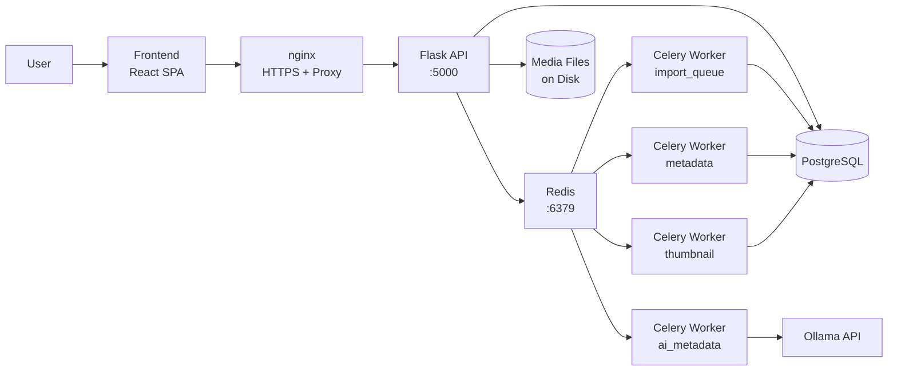
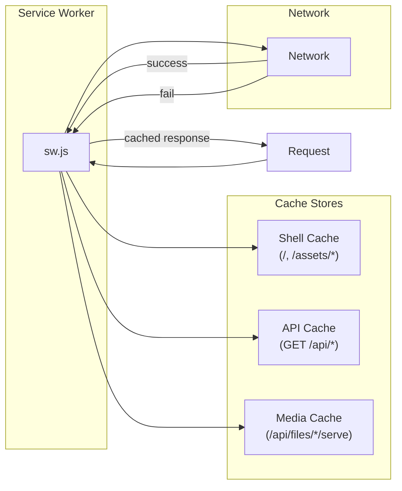

# Media Server

A scalable semantic-searchable media viewer for your home media collection.

## Stack

| Layer           | Technology                                                       |
| --------------- | ---------------------------------------------------------------- |
| Frontend        | React 19, React Router 7, Vite 6, Axios                         |
| Backend         | Flask 3, SQLAlchemy, Flask-Migrate, Gunicorn                     |
| Task Queue      | Celery 5 + Redis                                                 |
| AI              | Ollama (vision + text models)                                    |
| Database        | PostgreSQL                                                       |

## Architecture



## Project Structure

```
media-server/
├── backend/
│   ├── app/
│   │   ├── api/routes.py            # API routes
│   │   ├── models/                  # SQLAlchemy models
│   │   ├── utility/                 # Image, hash, location, video utilities
│   │   ├── tasks.py                 # Celery task definitions
│   │   ├── config.py                # App configuration
│   │   └── __init__.py              # App factory
│   ├── migrations/                  # Alembic migrations
│   ├── scripts/
│   │   └── regenerate_heic_thumbnails.py
│   ├── Dockerfile
│   └── requirements.txt
├── frontend/
│   ├── src/
│   │   ├── pages/                   # Home, Importer, Gallery, Settings, etc.
│   │   ├── components/              # Navbar, FileViewer, TreeNode
│   │   ├── services/                # API client, IndexedDB wrapper
│   │   └── hooks/                   # useApi
│   ├── public/
│   │   ├── manifest.json            # PWA manifest
│   │   ├── sw.js                    # Service worker (offline caching)
│   │   ├── icon.svg, icon-192.png, icon-512.png
│   ├── index.html                   # Entry point + loading animation
│   ├── nginx.conf                   # HTTPS + API proxy
│   └── Dockerfile
├── docker-compose.yml
└── README.md
```

## Quick Start

### Prerequisites

- Python 3.10+, Node.js 18+
- PostgreSQL 14+, Redis 6+
- [Ollama](https://ollama.ai) with a vision model (`ollama pull llava`)

### Backend

```bash
cd backend
python -m venv .venv && source .venv/bin/activate
cp .env.example .env
pip install -r requirements.txt
flask db upgrade
python run.py
```

### Celery Workers

```bash
celery -A app.tasks.celery worker -Q import_queue,metadata,ai_metadata,thumbnail -l info
```

### Frontend

```bash
cd frontend
npm install
npm run dev
```

Frontend starts at **http://localhost:5173** (proxies `/api` to backend).

## PWA & Offline

The app is installable as a Progressive Web App.

### Install

| Platform | URL                                           |
| -------- | --------------------------------------------- |
| Dev      | `http://localhost:5173` (install prompt)      |
| Docker   | `https://homeserver.local:3443` (accept self-signed cert once) |

### Offline Strategy



| Cache       | Strategy        | Contents                                   |
| ----------- | --------------- | ------------------------------------------ |
| Shell       | Cache-first     | App shell, JS, CSS (precached on install)  |
| API         | Network-first   | File listings, metadata, tags, stats       |
| Media       | Network-first   | Images (full), videos (≤50 MB, background) |

As you scroll the gallery, each page of results and every image you view is cached automatically for offline access. Videos are cached in the background after first play.

### Loading Animation

When the PWA launches, a fluid animated loading screen (dark gradient blobs, rotating rings, pulsing icon) is shown until React mounts.

## HEIC/HEIF Support

HEIC files (iPhone default) are supported throughout the app via ImageMagick conversion.

| Feature                 | Approach                              |
| ----------------------- | ------------------------------------- |
| Image display           | ImageMagick `convert` → JPEG stream   |
| EXIF extraction         | ImageMagick (with `libheif` delegate) |
| Thumbnail generation    | ImageMagick → Pillow                  |
| AI metadata (Ollama)    | ImageMagick → JPEG base64             |
| Perceptual hashing      | ImageMagick → Pillow                  |

### Regenerate Thumbnails

```bash
# Local
python backend/scripts/regenerate_heic_thumbnails.py

# Docker
docker compose exec backend python scripts/regenerate_heic_thumbnails.py
```

## Features

### Media Importer
Recursively scans directories, filters by MIME type, persists metadata without copying files. Each import creates a new session.

### Gallery & File Viewer
- **Tree view** — lazy-loaded directory browser organized by import session
- **Infinite-scroll grid** — Home page with search, media type/dimension filters
- **Overlay viewer** — zoom, rotate, flip, grayscale, favorite, download
- **Metadata panel** — EXIF, GPS, dimensions, duration, date taken, AI tags and description

### AI Metadata (Ollama)
Files are sent to a local Ollama model for automatic tagging, description, and search keyword generation. Tags from parent folder names are merged with AI tags.

### Duplicate Detection
- **Exact duplicates** — SHA256 hash grouping
- **Near duplicates** — 64-bit difference hash with band-indexed lookup (Hamming distance ≤ 10)

### Nickname Persistence
Upload nickname is saved to IndexedDB and editable from Settings, providing a consistent default across sessions.

### Database Migrations

```bash
flask db upgrade              # Apply pending migrations
flask db migrate -m "desc"    # Create new migration
flask db downgrade            # Rollback one migration
```

### Available Scripts

| Command                              | Description               |
| ------------------------------------ | ------------------------- |
| `make backend` / `make frontend`     | Start dev servers         |
| `make test`                          | Run backend tests         |
| `npm run build`                      | Production frontend build |
| `make build`                         | Vite production build     |
| `flask db upgrade`                   | Apply database migrations |

## API Endpoints

| Method | Path                              | Description                          |
| ------ | --------------------------------- | ------------------------------------ |
| GET    | `/health`                         | Health check                         |
| GET    | `/api/status`                     | API status                           |
| POST   | `/api/import`                     | Import media folder                   |
| GET    | `/api/files`                      | Paginated file list (with filters)   |
| GET    | `/api/files/<id>/serve`           | Serve image/video file               |
| GET    | `/api/files/<id>/metadata`        | EXIF, GPS, tags, AI description      |
| GET    | `/api/files/<id>/thumbnail`       | Base64 thumbnail                     |
| GET    | `/api/files/<id>/near-duplicates` | Perceptually similar images          |
| PATCH  | `/api/files/<id>/tags`            | Update tags                          |
| PATCH  | `/api/files/<id>/favorite`        | Toggle favorite                      |
| POST   | `/api/files/<id>/edit`            | Apply image edits                    |
| GET    | `/api/directories`                | List imported directories            |
| GET    | `/api/duplicates`                 | Exact and near-duplicate groups      |
| GET    | `/api/favorites`                  | Favorited files                      |
| GET    | `/api/tags`                       | Tag frequency list                   |
| GET    | `/api/stats`                      | System statistics                    |
| POST   | `/api/upload`                     | Upload files                         |
