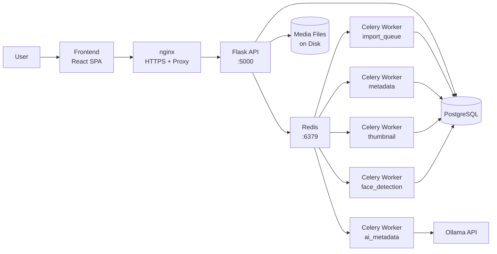

# Media Server

A scalable, semantic-searchable media viewer for your home media collection. Features AI-powered tagging, face detection & recognition, image/video editing, GPS map visualization, duplicate detection, collections, hidden files, and full PWA offline support.

## Quick Start

**Prerequisites:** Python 3.10+, Node.js 18+, PostgreSQL 14+, Redis 6+, and Ollama (with a vision model). See [docs/getting-started.md](docs/getting-started.md) for the full setup, Docker deployment, and troubleshooting.

**Backend + Celery:**
```bash
cd backend
python -m venv .venv && source .venv/bin/activate
cp .env.example .env
pip install -r requirements.txt
flask db upgrade
python run.py
# In another shell (venv active):
celery -A app.tasks.celery worker -Q import_queue,metadata,ai_metadata,thumbnail,face_detection -l info
```

**Frontend:**
```bash
cd frontend
npm install
npm run dev
```
Open **http://localhost:5173** (proxies `/api` to the backend on :5000).

**AI models:** `ollama pull llava && ollama pull llama3.2`

> For a fully containerized stack, run `docker compose up --build -d`. See [docs/getting-started.md](docs/getting-started.md).

## Stack

| Layer           | Technology                                                       |
| --------------- | ---------------------------------------------------------------- |
| Frontend        | React 19, React Router 7, Vite 6, Axios, Recharts, Leaflet      |
| Backend         | Flask 3, SQLAlchemy, Flask-Migrate, Gunicorn                     |
| Task Queue      | Celery 5 + Redis (5 workers: import, metadata, AI, thumbnail, face) |
| AI              | Ollama (vision + text models) + InsightFace (face detection/recognition) |
| Database        | PostgreSQL 16 (production), SQLite (development/testing)          |
| Maps            | Leaflet + React-Leaflet (OpenStreetMap tiles with service worker caching) |

## Features

- **Media management** — recursive import, uploads with directory management, Media Explorer (grid/list), favorites, folder customization, trash, and filesystem browsing.
- **Gallery & viewer** — infinite-scroll grid, overlay viewer with zoom/pan/rotate, metadata sidebar with reverse geocoding, prominent colors, histogram.
- **Editing** — full image editor (filters, adjust, light, effects, details, colors, crop, rotate/flip, export) and a browser-based video editor with WebGL GPU rendering.
- **AI metadata** — automatic tagging, description, and search keywords via local Ollama vision models; ingredient scanner.
- **Faces** — InsightFace detection, person recognition, auto-grouping, merge/batch operations, timelines.
- **Map** — GPS visualization, nearby filtering, saved locations, tile caching.
- **Search & filters** — full-text search across files/persons/memories, type/tag/dimension/sort filters.
- **Duplicates** — exact (SHA-256) and near-duplicate (dhash) detection with keep flags.
- **Collections, favorites, hidden files, user memories, statistics, tools, PWA offline.**

See [docs/features.md](docs/features.md) for the complete feature reference.

## Architecture



The React SPA talks to a Flask API backed by PostgreSQL and Redis. Long-running work (imports, metadata, AI, thumbnails, face detection) is dispatched to dedicated Celery workers. AI features call a local Ollama instance; face detection uses InsightFace. The frontend is an installable PWA with a service worker caching shell, API, media, thumbnails, map tiles, and MUI assets for offline use.

The Flask backend is layered for maintainability: one Blueprint per domain under `app/api/` (files, upload, explorer, map, tools, filters, sessions, system, plus face/collection/memory), a `app/services/` layer holding domain business logic, single-concern helpers in `app/utility/` (each with unit tests), and one Celery task module per worker under `app/tasks/`. See [docs/architecture.md](docs/architecture.md) and [docs/project-structure.md](docs/project-structure.md).

## Documentation

Detailed reference material lives in [`docs/`](docs/):

| Document | Contents |
|----------|----------|
| [docs/getting-started.md](docs/getting-started.md) | Prerequisites, full manual/Docker setup, troubleshooting, common failures |
| [docs/features.md](docs/features.md) | Complete feature reference and design system |
| [docs/architecture.md](docs/architecture.md) | Stack details, component/data flow, and deployment topology |
| [docs/project-structure.md](docs/project-structure.md) | Full backend/frontend directory tree |
| [docs/database.md](docs/database.md) | Database entities, relationships, and indexes |
| [docs/api-endpoints.md](docs/api-endpoints.md) | Full REST API endpoint reference |
| [docs/configuration.md](docs/configuration.md) | Environment variables and required directories |
| [docs/monitoring.md](docs/monitoring.md) | Prometheus metrics, Grafana dashboard, scrape config |
| [docs/developer-guide.md](docs/developer-guide.md) | Makefile targets, helper scripts, Docker commands, code quality |
| [docs/pwa.md](docs/pwa.md) | PWA / offline behavior and cache stores |
| [docs/writing-a-tool.md](docs/writing-a-tool.md) | How to build a new auto-discovered tool |
| [docs/face-detection.md](docs/face-detection.md) | In-depth face detection pipeline |

## Developer Notes

- Every feature change should follow the conventions in `AGENTS.md`.
- Run tests with `make test` and frontend lint with `make lint` (see [docs/developer-guide.md](docs/developer-guide.md)).
- Database migrations: `flask db upgrade` (apply), `flask db migrate -m "desc"` (create). See [docs/developer-guide.md](docs/developer-guide.md).
