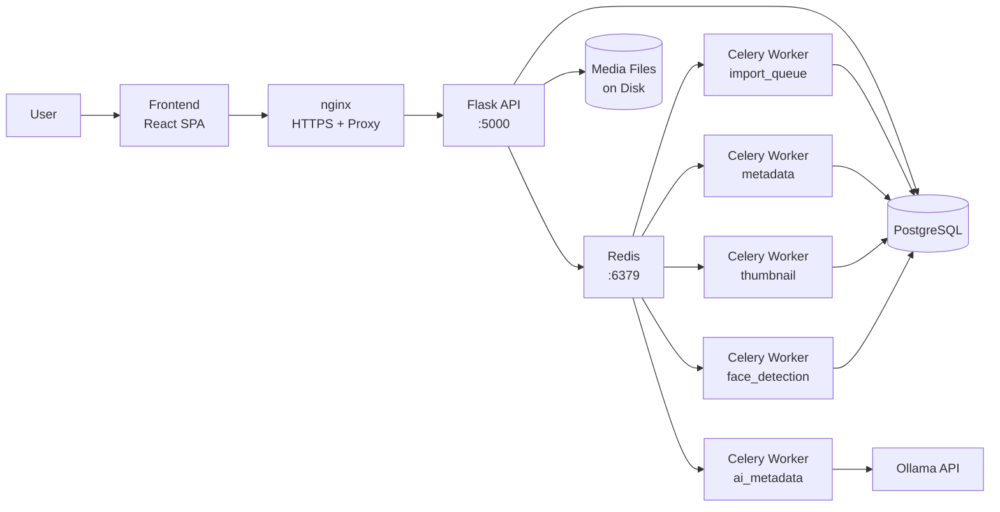

# Architecture

## Topology

## Components

| Layer | Technology | Role |
|-------|-----------|------|
| Frontend | React 19, React Router 7, Vite 6, Axios, Recharts, Leaflet | SPA that talks to the API, renders galleries/editors/maps, and manages offline caches |
| Backend | Flask 3, SQLAlchemy, Flask-Migrate, Gunicorn | REST API, ORM models, DB migrations, Prometheus metrics, service worker asset serving |
| Task Queue | Celery 5 + Redis | Background processing for long-running media work |
| AI | Ollama + InsightFace | Vision/text inference and face detection/recognition |
| Database | PostgreSQL 16 (prod) / SQLite (dev+test) | Persistent storage for all entities |
| Maps | Leaflet + OpenStreetMap | GPS visualization with service-worker tile caching |

## Request & Data Flow

1. The browser SPA calls the Flask API via an Axios client (`frontend/src/services/api.js`). The client also keeps an IndexedDB cache of GET responses so the app works offline.
2. The Flask API reads/writes PostgreSQL through SQLAlchemy models and pushes background jobs onto Redis-backed Celery queues.
3. Dedicated Celery workers consume jobs, perform the heavy lifting (metadata, thumbnails, AI, faces), write results back to PostgreSQL, and (for AI/faces) call the local Ollama / InsightFace runtimes.
4. Media files live on disk; the API serves them resized/converted (HEIC→JPEG, auto-resize >1MB) and streams videos with Range support.
5. A service worker (`frontend/public/sw.js`) caches the app shell, API responses, thumbnails, full media, map tiles, and the lazy-loaded MUI chunk for offline use.

## Background Processing (Celery)

| Queue | Worker | Concurrency | Work |
|-------|--------|-------------|------|
| `import_queue` | import | 1 | Recursive filesystem scan, session creation |
| `metadata` | metadata | 10 | EXIF/ffprobe extraction, hashing, dhash |
| `ai_metadata` | ai | 2 | Ollama vision/text calls for description & tags |
| `thumbnail` | thumbnail | 10 | ffmpeg/ImageMagick thumbnail generation |
| `face_detection` | face | 1 | InsightFace detection + person matching |

Queue names are read from `backend/.env` (`CELERY_QUEUE_IMPORT`, `CELERY_QUEUE_METADATA`, `CELERY_QUEUE_AI`, `CELERY_QUEUE_THUMBNAIL`, `CELERY_QUEUE_FACE`).

## Caching Strategy

| Cache | Strategy | Contents |
|-------|----------|----------|
| Shell (`media-server-shell-v1`) | Cache-first | App JS/CSS, `/index.html` |
| API (`media-server-api-v1`) | Network-first | File listings, metadata, tags (offline fallback) |
| Thumbnails (`media-server-thumbs-v1`) | Cache-first | Image thumbnails (`/api/files/<id>/thumbnail`) |
| Media (`media-server-media-v1`) | Custom (Range-aware) | Full images/videos (`/api/files/<id>/serve`) |
| Map Tiles (`media-server-tiles-v1`) | Cache-first | OpenStreetMap/CartoDB/ArcGIS/NASA tiles |
| MUI (`media-server-mui-v1`) | Cache-first | Lazy-loaded Material UI chunk |

`CLEAR_CACHES` deletes every cache except the shell; `CLEAR_SINGLE_CACHE` removes one named cache. See [docs/pwa.md](pwa.md).

## AI Pipeline

- **Vision (metadata):** multi-frame extraction → Ollama vision model (`llava` by default) → Pydantic-validated `AiMetadataModel` (description, tags, search_words).
- **Text:** Ollama text model (`llama3.2`) for ingredient analysis / recipe generation.
- **Faces:** InsightFace `buffalo_l` → 512-d embeddings → cosine-distance matching to `Person` entities (threshold 0.4); average encoding recomputed per person.

## Deployment Topology

- **Manual:** run the Flask dev server, Celery workers, Vite dev server, PostgreSQL, and Redis directly on the host.
- **Docker:** 9 services via `docker-compose.yml` (backend, 5 workers, frontend/Nginx, PostgreSQL, Redis). SSL is generated at build time; metrics exposed on ports 9200–9205. A combined-worker variant is available in `docker-compose.workers.yml`. See [docs/developer-guide.md](developer-guide.md) and [docs/getting-started.md](getting-started.md).
