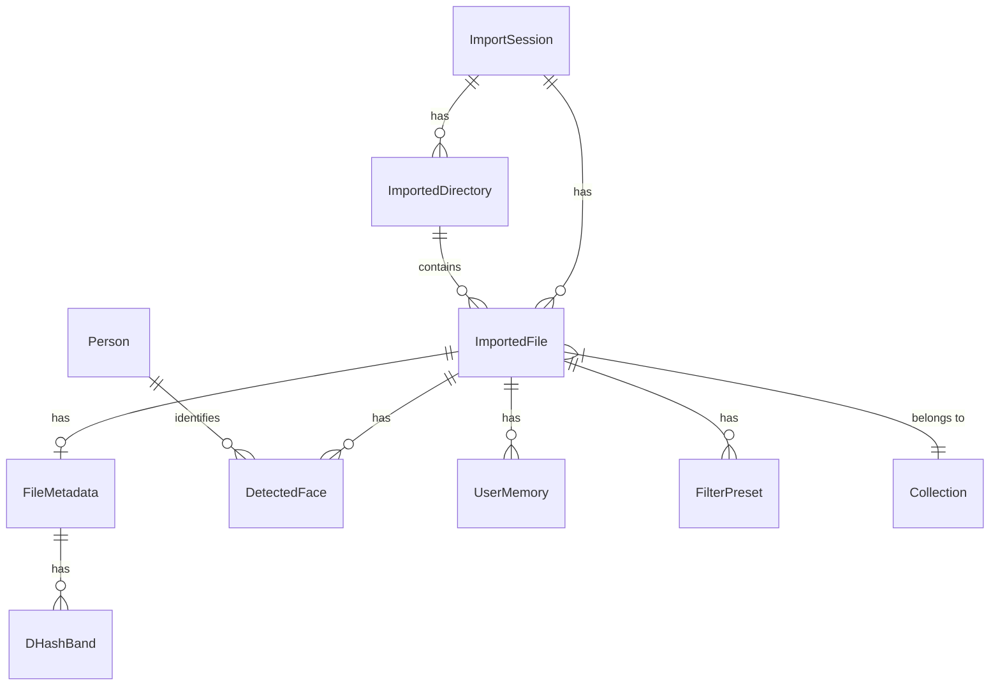

# Database

## Core Media

| Model | Table | Key Fields | Purpose |
|-------|-------|------------|---------|
| `ImportSession` | `import_sessions` | root_path, mime_groups, total_files | Top-level container for a media import batch. Cascades delete to all directories and files. |
| `ImportedDirectory` | `imported_directories` | session_id, path, name, parent_path, deleted | Filesystem directory hierarchy within a session. Unique on `(session_id, path)`. |
| `ImportedFile` | `imported_files` | session_id, directory_id, filename, file_path, mime_type, size, is_favorite, is_hidden, is_primary, nickname, deleted | Central entity — one row per imported media file. Unique on `(session_id, file_path)`. `is_primary` excludes file from duplicate detection. |
| `FileMetadata` | `file_metadata` | file_id (1:1), exif, lat/lng, date_taken, width/height, duration, tags, description, search_words, file_hash, dhash, thumbnail, metadata_status, thumbnail_status | Extended metadata attached to every file. Populated asynchronously by Celery workers. |
| `DHashBand` | `dhash_bands` | metadata_id, band_index, band_value | Perceptual hash bands for near-duplicate detection. Indexed for fast lookup. |

## People & Faces

| Model | Table | Key Fields | Purpose |
|-------|-------|------------|---------|
| `Person` | `persons` | name, thumbnail, face_count, avg_encoding, meta_info | Named or unnamed person entity. Stores a weighted-average face encoding for matching. |
| `DetectedFace` | `detected_faces` | file_id, person_id, encoding, bounding_box, confidence, thumbnail, age, gender, face_status | Individual face detection on a specific file. Links a file to a person (optional). |

## Organization

| Model | Table | Key Fields | Purpose |
|-------|-------|------------|---------|
| `Collection` | `collections` | name, description, cover_file_id | User-created named groupings of files (many-to-many via `collection_files`). |
| `collection_files` | `collection_files` | collection_id, file_id | Join table for Collection ↔ ImportedFile many-to-many. |
| `FavoriteFolder` | `favorite_folders` | path, name | Bookmarked filesystem paths for quick access in the Explorer. |

## User Data

| Model | Table | Key Fields | Purpose |
|-------|-------|------------|---------|
| `UserMemory` | `user_memories` | file_id, content, tags | User-authored notes/annotations on files. FK has `ON DELETE CASCADE`. |
| `SavedLocation` | `saved_locations` | name, lat, lng, radius | Named geographic points of interest for the Map tab. |
| `FilterPreset` | `filter_presets` | name, operations, file_id | Saved image editor filter configurations. Optional link to a file. |

## Relationships

**Key behaviors:**
- Deleting an `ImportSession` cascades to all its directories and files
- Deleting an `ImportedFile` cascades to its `UserMemory` records (DB-level `ON DELETE CASCADE`)
- `DetectedFace.person_id` is nullable — unnamed faces have `person_id = NULL`
- `Collection.files` is many-to-many — deleting a collection only removes join rows, not files
- Face naming (`PUT /api/faces/<id>`) propagates to all unnamed faces with similar embeddings (cosine distance < 0.3)

## Database Indexes

The following indexes are defined across 9 tables to support query performance:

| Table | Index | Type | Covers |
|-------|-------|------|--------|
| `import_sessions` | `root_path` | Single | Session lookup by root path |
| `import_sessions` | `created_at` | Single | Session listing sort |
| `imported_directories` | `session_id + parent_path` | Composite | Browse hierarchy queries |
| `imported_directories` | `name` | Single | Directory listing sort |
| `imported_directories` | `path`, `parent_path`, `deleted` | Single | Explorer hierarchy filters |
| `imported_files` | `session_id + relative_path` | Composite | Upload management (8+ queries) |
| `imported_files` | `created_at + deleted` | Composite | Default file listing sort + filter |
| `imported_files` | `directory_id` | Single | FK join to directories |
| `imported_files` | `mime_type` | Single | Media type filtering (7+ queries) |
| `imported_files` | `relative_path` | Single | Path matching (10+ queries) |
| `imported_files` | `filename` | Single | File name sort |
| `imported_files` | `is_favorite` | Single | Favorites listing |
| `imported_files` | `nickname` | Single | Upload nickname filtering |
| `imported_files` | `deleted` | Single | Trash filtering |
| `imported_files` | `is_hidden` | Single | Hidden files filtering |
| `file_metadata` | `file_hash` | Single | Duplicate detection |
| `file_metadata` | `latitude + longitude` | Composite | GIS range queries (saved locations) |
| `file_metadata` | `metadata_status` | Single | Metadata status stats |
| `file_metadata` | `thumbnail_status` | Single | Thumbnail status stats |
| `dhash_bands` | `band_index + band_value` | Composite | Near-duplicate lookup |
| `dhash_bands` | `metadata_id` | Single | FK cascade deletes |
| `persons` | `name` | Single | Face assignment lookup + search |
| `persons` | `face_count` | Single | Person listing sort |
| `persons` | `created_at` | Single | Person listing sort |
| `detected_faces` | `file_id`, `person_id` | Single | FK joins |
| `detected_faces` | `created_at` | Single | Face listing pagination |
| `detected_faces` | `confidence` | Single | Face confidence sort |
| `saved_locations` | `name` | Single | Location listing sort |
| `filter_presets` | `name` | Single | Preset listing + lookup |

See [docs/api-endpoints.md](api-endpoints.md) for the data-access API and [docs/configuration.md](configuration.md) for `DATABASE_URL`.
