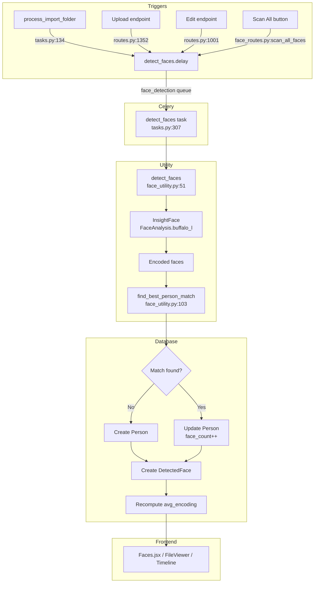
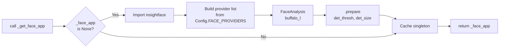
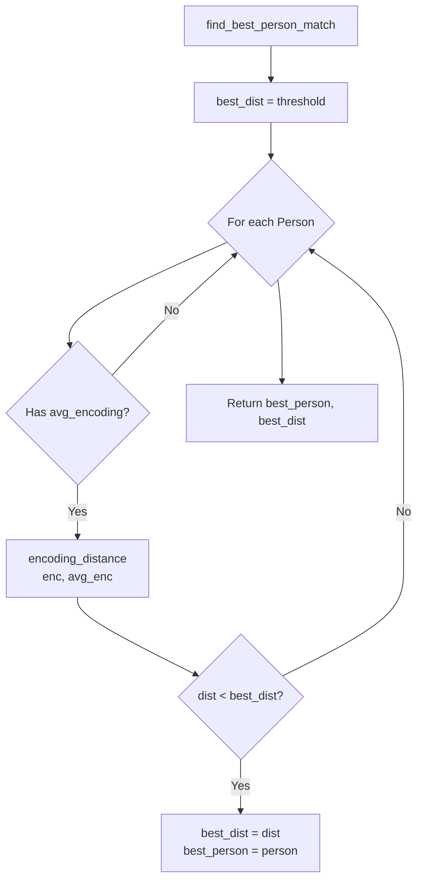
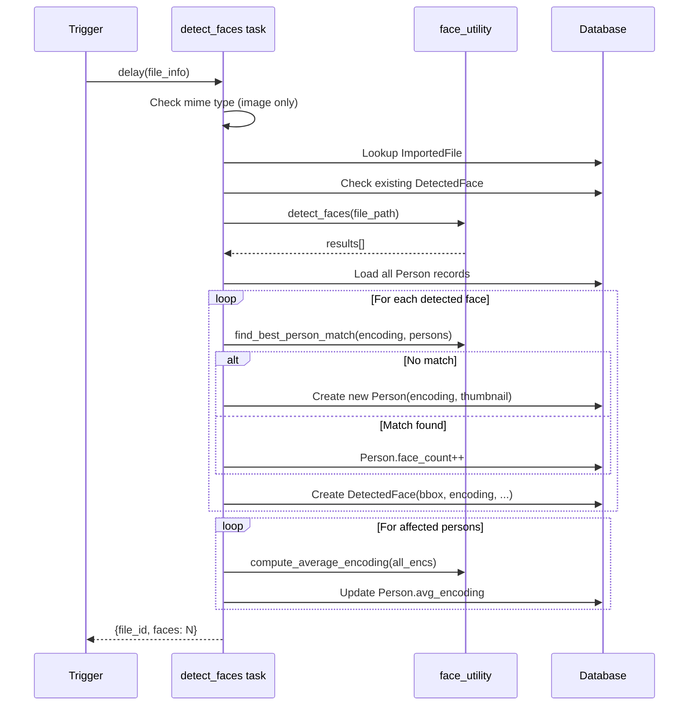

# Face Detection & Recognition Pipeline

## Overview

The face subsystem uses **InsightFace** (buffalo_l model) for detection and recognition. It runs as a dedicated Celery worker (face_detection queue), processing images on import, upload, and edit. Each detected face is matched against existing Person records via cosine-distance on 512-dimensional embeddings.

## Architecture



## Core Functions (face_utility.py)

### 1. Singleton — `_get_face_app()`



Lazy-loads and caches the InsightFace model as a module-level singleton. The provider list (`Config.FACE_PROVIDERS`) defaults to `CUDAExecutionProvider,TensorrtExecutionProvider,CPUExecutionProvider` — GPU first, CPU fallback.

### 2. Detection — `detect_faces(image_path)`

```mermaid
flowchart TD
    A[detect_faces<br/>image_path] --> B[PIL Image.open<br/>convert to RGB]
    B --> C[_pil_to_cv_image<br/>RGB → BGR numpy]
    C --> D[_get_face_app]
    D --> E[app.get cv_img]
    E --> F{For each face}
    F --> G[Extract bbox]
    G --> H[Extract normed_embedding<br/>512-dim vector]
    H --> I{Bbox valid?}
    I -->|Yes| J[Crop face region]
    J --> K[_pil_to_base64_jpeg<br/>160x160 thumbnail]
    I -->|No| L[thumbnail = null]
    K --> M[Collect result dict]
    L --> M
    M --> N[Return results[]]
```

Returns a list of dicts with:

| Field | Type | Description |
|---|---|---|
| `bounding_box` | `{x, y, w, h}` | Pixel coordinates |
| `confidence` | `float` | Detection score (0–1) |
| `encoding` | `float[512]` | Normalised embedding for face recognition |
| `thumbnail` | `str` | Base64 JPEG data URI (160x160) |
| `age` | `float` | Estimated age |
| `gender` | `int` | 0 = female, 1 = male |

### 3. Person Matching — `find_best_person_match(encoding, persons, threshold)`



Iterates existing Person records and returns the closest match below `FACE_MATCH_THRESHOLD` (default 0.4). A lower threshold = stricter matching.

### 4. Distance Metric — `encoding_distance(enc_a, enc_b)`

Computes cosine distance: `1 - cos(θ)` where:

```mermaid
flowchart LR
    A[enc_a, enc_b] --> B{Dimensions<br/>valid?}
    B -->|No| C[return 1.0]
    B -->|Yes| D[dot = a · b]
    D --> E[norm_a = |a|]
    E --> F[norm_b = |b|]
    F --> G{Norms<br/>> 0?}
    G -->|No| C
    G -->|Yes| H[return 1 - dot / (norm_a × norm_b)]
```

Range: 0.0 (identical) to 1.0 (opposite). Values above 1.0 cannot occur with normed embeddings, but the function clamps by returning `1.0` on degenerate inputs.

### 5. Encoding Averaging — `compute_average_encoding(encodings)`

Element-wise mean across a list of 512-d encoding vectors. Used to update a Person's `avg_encoding` when new faces are assigned to them.

```python
arr = np.array(encodings, dtype=np.float32)  # shape (N, 512)
avg = np.mean(arr, axis=0)                    # shape (512,)
```

## Celery Task (tasks.py:307)



Key behaviours:

- **Idempotency**: Skips if `DetectedFace` records already exist for the file (line 325–327)
- **Person creation**: New persons get `avg_encoding` set to the single face's encoding, `face_count = 1`
- **Person update**: Existing persons get `face_count` incremented and `avg_encoding` recomputed as the mean of all their encodings (old avg + new encodings)
- **Error handling**: Retries up to 2 times with a 60-second countdown on detection failure

## Configuration

| Config Key | Default | Effect |
|---|---|---|
| `FACE_MATCH_THRESHOLD` | `0.4` | Max cosine distance for a person match. Lower = stricter, fewer false positives. |
| `FACE_DET_THRESH` | `0.3` | InsightFace detection confidence threshold. Lower = detects more faces (but more false positives). |
| `FACE_PROVIDERS` | `CUDAExecutionProvider, TensorrtExecutionProvider, CPUExecutionProvider` | Comma-separated ONNX Runtime providers tried in order. Falls back to CPU. |

## Database Models

### DetectedFace

| Column | Type | Notes |
|---|---|---|
| `file_id` | FK → `ImportedFile` | NOT NULL, indexed |
| `person_id` | FK → `Person` | Nullable (unassigned) |
| `encoding` | JSON | 512-d normed embedding |
| `bounding_box` | JSON | `{x, y, w, h}` |
| `confidence` | Float | Detection score |
| `thumbnail` | Text | Base64 JPEG (160x160) |
| `age` | Float | Estimated age |
| `gender` | Integer | 0=female, 1=male |
| `face_status` | String(32) | Always "detected" |

### Person

| Column | Type | Notes |
|---|---|---|
| `name` | String(255) | Nullable |
| `thumbnail` | Text | Representative face thumbnail |
| `face_count` | Integer | Number of faces assigned |
| `avg_encoding` | JSON | 512-d mean encoding for matching |
| `meta_info` | JSON | Reserved |
| `faces` | relationship | One-to-many to `DetectedFace` |

## API Endpoints

| Route | Method | Purpose |
|---|---|---|
| `/api/persons` | GET | Paginated person list |
| `/api/persons/<id>` | PUT | Rename person |
| `/api/persons/<id>` | DELETE | Delete person |
| `/api/persons/merge` | POST | Merge multiple persons |
| `/api/persons/scan` | POST | Scan all unprocessed images |
| `/api/persons/<id>/faces` | GET | Faces belonging to a person |
| `/api/persons/<id>/files` | GET | Files containing a person |
| `/api/persons/<id>/timeline` | GET | Timeline buckets for a person |
| `/api/faces` | GET | List/recent faces |
| `/api/faces/<id>` | PUT | Assign name to face |
| `/api/faces/stats` | GET | Aggregate face/person counts |
| `/api/files/<id>/faces` | GET | Faces in a specific file |
| `/api/files/<id>/detect-faces` | POST | Detect faces on a file |

## Frontend Integration

- **Faces page** (`Faces.jsx`): Grid/list of person cards, merge toolbar, scan-all button, rename/delete controls
- **FileViewer sidebar**: Shows detected faces per file, inline name editing with autocomplete from existing persons
- **Timeline page**: Aggregates photos by person using `personGroups` (AND logic across groups)

## Docker Deployment

The face detection worker runs with `concurrency=1` and listens on the `face_detection` queue:

```yaml
worker-face:
    command: celery -A app.tasks.celery worker -Q face_detection -l info --concurrency=1
```

Requires the InsightFace model volume mounted from the host (`/home/pritam/.insightface`).
